# Implementation Plan: Deploy Docusaurus site to GitHub Pages with automated CI/CD

**Branch**: `001-deploy-gh-pages` | **Date**: 2025-12-07 | **Spec**: [spec.md](spec.md)
**Input**: User description: "Create deployment architecture, workflow description, and validation steps for Docusaurus project deployed to GitHub Pages with automated CI/CD, integration with GitHub Actions workflows, and ensure zero-touch deployment after initial setup."

**Note**: This template is filled in by the `/sp.plan` command. See `.specify/templates/commands/plan.md` for the execution workflow.

## Summary

Implementation of automated deployment for the Physical AI & Humanoid Robotics educational platform to GitHub Pages. This includes setting up GitHub Actions workflows for continuous integration and deployment, ensuring zero-touch deployment after initial setup, and establishing monitoring and validation procedures for the deployed site.

## Technical Context

**Language/Version**: JavaScript/TypeScript, Node.js 18+
**Primary Dependencies**: Docusaurus 3.x, GitHub Actions, peaceiris/actions-gh-pages
**Storage**: GitHub Pages hosting, GitHub repository for source code
**Testing**: GitHub Actions workflow validation, site accessibility checks, build verification
**Target Platform**: GitHub Pages
**Project Type**: Static site deployment (Docusaurus)
**Performance Goals**: <5s site load time, <10min deployment time, >99% uptime
**Constraints**: GitHub Pages limitations (no server-side processing, 1GB storage, 100MB per file)
**Scale/Scope**: Single educational site serving multiple concurrent users

## Architecture Decision Records (ADRs)

### ADR-001: GitHub Pages for Static Hosting
**Context**: Need to select a hosting platform for the Docusaurus-generated static site
**Decision**: Use GitHub Pages for hosting
**Status**: Accepted
**Rationale**: Free hosting, seamless integration with GitHub Actions CI/CD, supports custom domains, good performance for static content
**Implications**: Limited to static content, subject to GitHub Pages quotas, tied to GitHub ecosystem

### ADR-002: GitHub Actions for CI/CD
**Decision**: Use GitHub Actions for continuous integration and deployment
**Status**: Accepted
**Rationale**: Native integration with GitHub repositories, free for public repos, extensive marketplace of actions
**Implications**: Requires GitHub repository, workflow configuration in .github/workflows/

## Implementation Approach

### Architecture Overview

```
Source Code (main branch) → GitHub Actions → Build Process → GitHub Pages (gh-pages branch) → Public Site
```

### Tech Stack & Dependencies

- **Static Site Generator**: Docusaurus 3.x
- **CI/CD Platform**: GitHub Actions
- **Deployment Action**: peaceiris/actions-gh-pages
- **Runtime Environment**: Node.js 18.x
- **Package Manager**: npm

### Project Structure

```text
specs/001-deploy-gh-pages/
├── plan.md                 # This file
├── research.md             # Technical research and feasibility analysis
├── data-model.md           # Data flow and configuration models
├── quickstart.md           # Quick start guide for deployment
└── contracts/
    └── deployment-api.yaml # Deployment configuration schema
```

## Deployment Architecture

### Infrastructure Components

1. **Source Repository**: GitHub repository containing Docusaurus source code
2. **CI/CD Pipeline**: GitHub Actions workflows for build and deployment
3. **Hosting Service**: GitHub Pages for static site hosting
4. **DNS Management**: GitHub Pages custom domain configuration (if applicable)

### Deployment Pipeline

```mermaid
graph LR
    A[Code Push to main] --> B[Trigger GitHub Actions]
    B --> C[Checkout Source Code]
    C --> D[Setup Node.js Environment]
    D --> E[Install Dependencies with npm ci]
    E --> F[Build Docusaurus Site with npm run build]
    F --> G[Deploy to GitHub Pages]
    G --> H[Site Available at GitHub Pages URL]
    H --> I[Validation Checks]
    I --> J[Monitoring]
```



### Configuration Model

**Deployment Configuration Schema**:
- `docusaurus.config.js`: Site configuration including base URL, GitHub Pages settings
- `.github/workflows/deploy.yml`: GitHub Actions workflow definition
- `package.json`: Build scripts and dependencies

**Environment Variables**:
- `GITHUB_TOKEN`: Auto-provided by GitHub Actions for deployment
- `GH_PAGES_TOKEN`: (Optional) Custom token for deployment if needed

## Deployment Workflow

### 1. Build Process
- Node.js 18.x environment setup
- Dependencies installation with `npm ci`
- Docusaurus site build with `npm run build`
- Output generation to `build/` directory

### 2. Deployment Process
- Use `peaceiris/actions-gh-pages` action
- Deploy built site to `gh-pages` branch
- Configure GitHub Pages to serve from `gh-pages` branch

### 3. Validation Process
- Site accessibility verification
- Link integrity checks
- Performance validation

## Integration Points

### With Docusaurus
- Leverages `docusaurus build` command
- Respects site configuration in `docusaurus.config.js`
- Maintains asset integrity during build process

### With GitHub Ecosystem
- GitHub Actions native integration
- GitHub Pages hosting service
- GitHub repository for source control

## Phases

### Phase 0: Research & Architecture (COMPLETED)
- [x] Docusaurus deployment methods research (GitHub Pages, Netlify, Vercel)
- [x] GitHub Actions workflow design
- [x] GitHub Pages limitations and constraints analysis
- [x] Research document created: `research.md`

### Phase 1: Design & Contracts (COMPLETED)
- [x] Data model extraction: `data-model.md`
- [x] Deployment configuration schema: `contracts/deployment-api.yaml`
- [x] Quickstart guide: `quickstart.md`
- [x] Deployment architecture finalized
- [x] Agent context updated

### Phase 2: Task Generation (COMPLETED)
- [x] Generate implementation tasks: `tasks.md`
- [x] Define testable acceptance criteria
- [x] Sequence tasks with proper dependencies
- [x] Create `tasks.md` with complete task breakdown

### Phase 3: Implementation (IN PROGRESS)
- [ ] T001 Set up GitHub Actions workflow for CI/CD in `.github/workflows/deploy.yml`
- [ ] T002 Configure Docusaurus for GitHub Pages deployment in `docusaurus.config.js`
- [ ] T003 Implement build validation and testing in GitHub Actions
- [ ] T004 Set up deployment monitoring and validation
- [ ] T005 Test deployment workflow with sample content
- [ ] T006 Document deployment procedures and troubleshooting

### Phase 4: Integration & Testing (PENDING)
- [ ] T007 Integrate with existing Docusaurus site
- [ ] T008 Perform end-to-end deployment testing
- [ ] T009 Validate site performance and accessibility
- [ ] T010 Set up monitoring for deployed site

### Phase 5: Polish & Documentation (PENDING)
- [ ] T011 Create comprehensive deployment documentation
- [ ] T012 Set up automated validation and monitoring
- [ ] T013 Final testing and performance optimization
- [ ] T014 Handoff and knowledge transfer

## Dependencies

### External Dependencies
- **GitHub Actions**: For CI/CD automation
- **peaceiris/actions-gh-pages**: For GitHub Pages deployment
- **Node.js 18.x**: Runtime environment for Docusaurus build
- **GitHub Pages**: Static site hosting service

### Internal Dependencies
- **Docusaurus Site**: Source code and configuration files
- **GitHub Repository**: Host for source code and deployment
- **Access Rights**: Permission to configure GitHub Actions and Pages

## Design Decisions Highlighted

### 1. GitHub Actions Decision
**Choice**: Use GitHub Actions for CI/CD instead of external services
**Rationale**: Native integration with GitHub, no additional service dependencies, free for public repositories
**Impact**: Tightly coupled with GitHub ecosystem but eliminates external dependencies

### 2. Static Site Deployment Decision
**Choice**: Deploy static site to GitHub Pages instead of dynamic hosting
**Rationale**: Cost-effective, high availability, native GitHub integration, suitable for documentation site
**Impact**: Limited to static content, no server-side processing capabilities

### 3. Automated Deployment Decision
**Choice**: Implement zero-touch deployment after initial setup
**Rationale**: Reduces operational overhead, ensures consistency, enables frequent updates
**Impact**: Requires robust validation and monitoring systems

## Requirements Coverage

### Functional Requirements Supported
- **FR-001**: GitHub Actions workflow triggers on main branch pushes - *Planned in T001*
- **FR-002**: Node.js environment setup in Actions - *Planned in T001*
- **FR-003**: Dependency installation with npm ci - *Planned in T001*
- **FR-004**: Docusaurus site build process - *Planned in T001*
- **FR-005**: Deployment to GitHub Pages - *Planned in T001*
- **FR-006**: Site accessibility at GitHub Pages URL - *Validated in T004*
- **FR-007**: Error reporting during deployment - *Built into Actions*
- **FR-008**: Build completion within 5 minutes - *Target for T001*
- **FR-009**: Deployment within 2 minutes - *Target for T001*
- **FR-010**: Failed deployment protection - *Built into Actions*

### Non-Functional Requirements Supported
- **NFR-001**: >95% deployment success rate - *Validated in T004*
- **NFR-002**: >99% site uptime - *Monitored in T004*
- **NFR-003**: Secure deployment process - *Built into Actions*
- **NFR-004**: <5s site load time - *Validated in T004*
- **NFR-005**: Detailed workflow logs - *Provided by Actions*

### Success Criteria Coverage
- **SC-001**: Successful workflow execution - *Validated in T003*
- **SC-002**: <7min total deployment time - *Target for T001*
- **SC-003**: Site accessibility at target URL - *Validated in T004*
- **SC-004**: Workflow success status - *Provided by Actions*
- **SC-005**: Warning/error-free builds - *Validated in T003*
- **SC-006**: Correct site content display - *Validated in T004*
- **SC-007**: >95% success rate - *Monitored in T004*
- **SC-008**: <5s load time - *Validated in T004*

## Implementation Approach

The deployment implementation will follow a phased approach, starting with basic GitHub Actions workflow setup and progressing through validation and monitoring. Each phase builds upon the previous one, with validation checkpoints to ensure proper functionality before proceeding.